# Edge Services Immersion Day Workshop(Global Accelerator)
[ワークショップのリンク](https://catalog.workshops.aws/edge-services-immersionday/ja-JP/aws-global-accelerator)。

上記ワークショップの内、Global Acceleratorのもののみ実施している。

## アーキテクチャ
ALB+Lambdaによるバックエンドがあり、その前面に Global Acceleratorを配置する構成


## デプロイ方法
`cdk deploy`するのみ

## パフォーマンステスト方法
ワークショップの[Global Accelerator パフォーマンス](https://catalog.workshops.aws/edge-services-immersionday/ja-JP/aws-global-accelerator/performance)に記載されている方法。

Global Accelerator経由でのアクセスと、直接ALBにアクセスした際のパフォーマンスの違いをテストする

### ApacheBenchを使う場合
指定されたエンドポイントに対して500回のリクエストを10の並列接続で送り、サーバーの応答時間等を計測する。

```sh
# Global Accelerator
$ ab -n 500 -c 10 http://YOUR_ENDPOINT.awsglobalaccelerator.com/

# ELB(ap-northeast-1)
$ ab -n 500 -c 10 http://YOUR_ENDPOINT.ap-northeast-1.elb.amazonaws.com/
```

### curlを使う場合
プロジェクトに入っている`curl-format.txt`を使用。100KBのデータを20回取得する。

```sh
# Global Accelerator
$ for i in {1..20}; do curl -w @curl-format.txt -o /dev/null -s http://YOUR_ENDPOINT.awsglobalaccelerator.com/100KB; sleep 3; done | grep -v time_total:0

# ELB(ap-northeast-1)
$ for i in {1..20}; do curl -w @curl-format.txt -o /dev/null -s http://YOUR_ENDPOINT.ap-northeast-1.elb.amazonaws.com/100KB; sleep 3; done | grep -v time_total:0
```