# Edge Services Immersion Day Workshop(Global Accelerator)（ipv6バージョン）
[ワークショップのリンク](https://catalog.workshops.aws/edge-services-immersionday/ja-JP/aws-global-accelerator)。

上記ワークショップの内、Global Acceleratorのもののみ実施している。

## アーキテクチャ
ipv6の動作確認のため以下を全てDual Stackとしている。
* VPC
* Global Accelerator
* ALB

## デプロイ方法
`cdk deploy`するのみ

